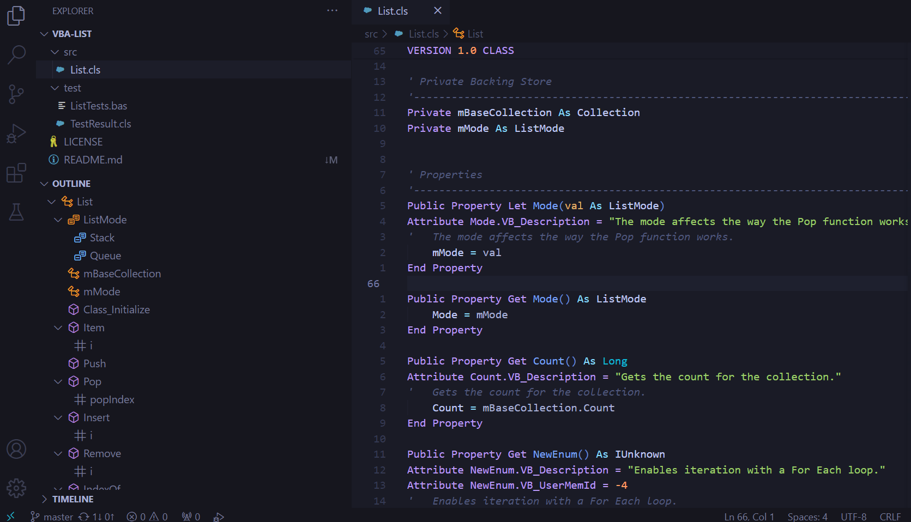

<p align="center">
	
</p>

# VBA Pro Extension for VScode

Provides Visual Basic for Applications (VBA) language support in Visual Studio Code using a Language Server Protocol (LSP) compliant backend. We all know that VBA is a dinosaur from the '90s, but it doesn't have to feel like one.



## Features

* Syntax highlighting
* Semantic highlighting
* Folding ranges
* Code Snippets
* Document symbols
* Document diagnostics
* Document formatting<sup>1</sup>

<sup>1</sup>Currently full document `Shift+Alt+F` formatting only.

### Syntax Highlighting

The most complete and bug-free TextMate grammar for VBA out there.

### Semantic Highlighting

TextMate does a great job with syntax highlighting but there are some things it can't know. Semantic highlighting is resolved by the language server and helps support where context is required.

### Folding Ranges

Folding ranges help organise code, collapsing things out of the way when you don't need to be looking at them.

### Code Snippets

A small but growing collection of highly useful code snippets. The idea is to keep these to a "rememberable" level, but if there's something you use all the time and you think it's missing, I'd love to hear from you.

### Document Symbols

Document Symbols allow you to view a structured outline of your code in the VSCode Outline view and breadcrumbs. These make it easy to understand and navigate files.

### Document Diagnostics

Displays warnings and errors in the Problems panel, as well as underlining the relevant sections in your code. Only a few diagnostics have been implemented to date, however these will be fleshed out over time.

## Document Formatting

Whole of document formatting is supported with `Shift+Alt+F`. Keeps your code properly indented and easy to read. Also supports half indentation for conditional compilation logic and the complexities that come with it.

```vba
#If VBA7 then
  Public Property Get Foo() As LongPtr
#Else
  Public Property Get Foo() As Long
#End If
	Foo = 0
End Property
```

## Coming Soon

* Hovers

## Installation

* Through the VSCode Marketplace,
* VSCode command palette `ext install notisdataanalytics.vba-lsp`, or;
* Download the [visx](../../releases/latest).

## Contributing

Contributors welcome! Please see [contributing.md](/contributing.md).
